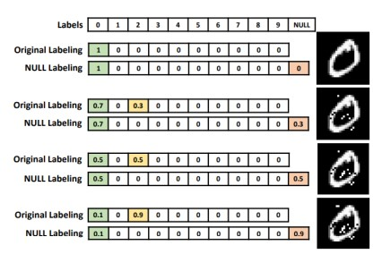
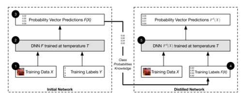

1. toc 
{:toc .large-only}

## Overview
### Countermeasures for Adversarial examples
    1. reactive: deep neural network built → detect adversarial examples
        - adversarial detecting
        - input reconstruction
        - network verification
    2. proactive: 더 robust(강력)하게 deep neural network built → generate adversarial examples
        - network distillation
        - adversarial (re)training
        - classifier robustifying
    3. ensembling method

## Network Distillation 

`[1]`
- knowledge distillation: 미리 잘 학습된 큰 네트워크의 지식을 실제로 사용하고자 하는 작은 네트워크에 전달하는 것 → 작은 모델로 더 큰 모델만큼의 성능을 얻을 수 있음.
- 대규모 네트워크에서 작은 네트워크로 지식을 전달하여 심층 신경망의 크기를 줄이기 위해 설계
- 과정
    - 첫번째 DNN에서 생성된 확률은 두번째 DNN을 훈련시키기 위한 input으로 사용
    - class의 확률 → 첫번째 DNN에서 배운 지식을 추출함(extract)
    - softmax: DNN의 마지막 layer를 normalize, class의 확률을 제공함
    - 공격이 주로 네트워크의 sensitivity(민감도)를 겨냥한다는 것을 알아냄 → high-temperature softmax사용 → 작은 perturbations(섭동)에 대한 모델의 민감도가 감소함.

`[2]`
Defensive Distillation
- training data X → target classes Y로 분류하는 nn F 이미 존재→ 최종적인 softmax layer는 Y에 대한 확률분포 생성
- 동일 dataset X에서 두번째 신경망 F’을 훈련시킨다 가정.
- training dataset의 target class label을 사용하는 대신, network F의 출력을 label로 사용 → F’훈련시킴.
- 새로운 label → 단순히 확률이 높은 class를 선택하는 것이 아닌, dataset X에 대한 더 많은 정보가 포함 됨.
- 마지막 softmax layer

`[3]`
- 목표: 기존 증류기술과 달리 방어증류는 outside the training data를 일반화하여 학습 프로세스 모델을 부드럽게 하는것
- basic idea: generate smooth classifier
    - AE에 더 탄력적인 부드러운 분류기 생성 → 
    - input perturbation에 대한 DNN의 민감도 줄임
- 추가적 기능
    - generalization ability 개선 (<-- nn architecture를 수정하지 X)
    - low training overhead
    - no testing overhead
    - 첫번째 DNN
        - output 확률 벡터 → data set에  label을 지정하는 데 사용
        - new label: soft label(<--> hard label)
    - 두번째 DNN
        - dataset: 새로 레이블이 지정된 data or (hard+soft label)의 조합
        - 첫번째 model에 대한 지식을 결합하기 때문에
            - smaller size
            - better robustness
            - smaller computational complexity

## Adversarial Training

`[1]`
- training stage에 adversarial examples를 추가함.
- 훈련의 모든 단계에서 adversarial examples 생성 → training set에 inject(주입하다)
- adversarial training⇒  DNN regularization제공, precision(정밀도) 향상

> e.g. ImageNet dataset; 
adversarial examples와 origin examples을 각 training step에 반반씩 사용함. → one-step attacks(FGSM)에만 효과가 있고, iterative attacks(BIM, ILLC methods)에서는 도움이 되지 않음.
one-step: 노이즈를 생성하기 위해 반복학습이 필요하지 않음
iterative: 노이즈를 생성하기 위해 반복학습이 필요함.

> e.g. MNIST dataset; 
adversarial training 사용은 overfitting피하기 위해 regularization에만 사용하는걸 제안함.

`[2]`
- adversarial example → 훈련 set에 주입 → increase model robustness
- 多 adversarial example를 생성 → targeted model을 training하는 동안; perturbed data(교란된 data)를 augment함.
- augmentation
    - original data, augmented examples → 모델에 공급
    - 수정된 objective function로 학습하여 수행
        - idea: 동일한 방향의 AE에 대해 동일한 클래스를 예측하도록하여 model robustness를 높인다.
        - J: original loss function
        - 주의; 원래 모델에서 만들어진 적대적 예제에서만 유용

`[3]`
- 기본 아이디어: 훈련data에 AE를 추가하고 훈련의 각 단계에서 지속적으로 새로운 AE를 생성하는 것
각 batch에서 AE의 수와 상대적 weight는 loss function에 의해 독립적으로 제어됨.
    - L(X|y): true label y가 있는 example X의 손실함수
    - m: 훈련 예제의 총 수
    - k: AE의 수
    - lambda: AE의 상대적 가중치를 제어하는 데 사용되는 hyper-parameter
    - e.g. k=0.5E m/2 일 경우, AE 수가 원래 예제의 수와 같을 때, 모델이 Adversarial Training에서 가장 좋은 효과를 나타냄.

- Adversarial Training != augmentation

|augmentation|Adversarial Training|
|--|--|
|test set에 나타날 수 있음.|test set에 표시되지 않지만 모델의 결함을 나타낼 수 있음|
||data가 악의적으로 교란될 때 분류 오류율을 최소화하는 프로세스|

- 다음 두 가지 상황에서 Adversarial Training사용
    - Overfitting
    - Security
- ensemble adversarial training
학습중인 모델 뿐만 아니라 다른 사전 학습된 모델에서도 구성된 학습 데이터를 보강 → AE의 다양성 높이고 일반화 능력 향상시킴.

## Adversarial Detecting

- DNN 학습된 것을 기준으로 한 이진분류기 → legitimate(clean) input, adversarial example
- 원래신경망의 auxiliary(보조) network로 adversarial example에 대한 detector를 만듦.
- SafetyNet
: adversarial detector의 기능으로 ReLU layer의 output의 binary threshold 추출, RBF-SVM 분류기 통해 adversarial image탐지 → 적들이 탐지기 알고 있어도 최적의 값 찾기 어려움.
    - added an outlier class
    - outlier로 분류 →  adversarial example 감지함.
    - MMD(Maximum mean discrepancy), ED(energy distance)로 clean datasets와 adversarial datasets구별 가능
- Bayesian view; adversarial example감지
    - adversarial example의 불확실성 > clean data
    - input data 의 불확실성 추정 →  clean datasets와 adversarial datasets구별위해 Bayesian view사용
- probability divergence(발산)을 탐지기로 사용
    - PCA(principal component analysis) → whitening → adversarial example가 low-ranked components에서 다른 계수를 갖게됨.
- PixelCNN 훈련 → adversarial example과 clean data의 분포가 다름을 발견
    - PixelCNN 순위 기반으로; p-value 값 사용하여 adversarial example 거부 ⇒ FGSM, BIM, DeepFool, and C&W attack 탐지 가능

## Input Reconstruction

`[1]`
- adversarial example → 재구성(reconstruction)통해 deep learning model에 영향주지 않게 할 수 있음.
- deep contractive autoencoder제안: penalty가 있는 autoencoder network
- noise제거 autoencoder network: adversarial perturbations를 제거하기 위해  adversarial example를 원래 example로 encoding하도록 되어있음.
- reconstruction 방법 2가지
    - adding Gaussian noise
    - encoding them with autoencoder in MagNet
- PixelDefend; back to the training distribution using PixelCNN

`[2]`
Feature Squeezing → model hardening technique (== input reconstruction)
- data 표현의 복잡성(complexity)을 줄여 민감도(sensitivity)를 낮추어서 adversarial perturbation이 사라지게 하는 것.
- image dataset 접근방식에는 2가지 heuristics
    - pixel level에서 color depth를 줄인다. → 더 적은 값으로 색상을 인코딩 한다.
    - smoothing filter사용; 여러 입력이 단일 값으로 mapping되어 noise, adversarial공격으로부터 안전하게 만듦.

## Blocking the transferability

- adversarial 사례의 transferability 가능성 차단.
    - nn의 transferability → 한 분류기에서 생성된 AE가 다른 분류기에서 동일한 mistake를 수행할 것으로 예상됨.
- 3단계 NULL Labeling
    - idea: dataset에 새로운 Null label늘림 → 분류자가 null로 분류하여 AE를 거부하도록 훈련
    - 서로 다른 perturbation을 가진 AE
    - 분류기 → 각 이미지에 확률 벡터를 할당함.
    - perturbation이 높은 null label에 더 높은 확률 할당

- 과정
    - target classifier의 초기 training: clean dataset에서 수행
    - NULL 확률 계산
        - Null class에 속할 확률 ← 다른 양의 perturbation으로 생성된 AE에 대해 함수 f사용하여 계산됨.
    - Adversarial Training
        - clean dataset & AE → 원래 분류기로 다시 훈련
        - 훈련data의 label ← 이전 단계에서 얻은null확률 기반으로 결정
    
    ⇒ 이점: AE입력을 원래 label로 분류하는 대신 null label로 labeling함.
    adversarial 공격에 대한 가장 효과적인 방어 수단!!
    clean data의 정확성 손상시키지 않으면서 AE를 거부하는 데 정확함.

 

---

해당 포스트는 아래를 참고하여 작성되었습니다.

[1](https://ieeexplore.ieee.org/abstract/document/8611298?casa_token=_wxtB4aKbogAAAAA:I6XMnKzbLWt45nxB8FPMWHUqgLsJ8FRGCWzrpSXqv6_yE2YYfitwMZolUQ63IvkJiJUPreXSvimyaQ) Yuan, Xiaoyong, et al. "Adversarial examples: Attacks and defenses for deep learning." IEEE transactions on neural networks and learning systems 30.9 (2019): 2805-2824.

[2](https://arxiv.org/abs/1810.00069) Chakraborty, Anirban, et al. "Adversarial attacks and defences: A survey." arXiv preprint arXiv:1810.00069 (2018).

[3](https://ieeexplore.ieee.org/abstract/document/8842604?casa_token=QREue1G3iQwAAAAA:j-QTqJCQRnA8tVRiHw5TqJbO9ntCvAXKmiJIAiwUNQugSYm8gTSuxsYXN_EPApy01vIPwLI40d1o-A) Zhang, Jiliang, and Chen Li. "Adversarial examples: Opportunities and challenges." IEEE transactions on neural networks and learning systems 31.7 (2019): 2578-2593.