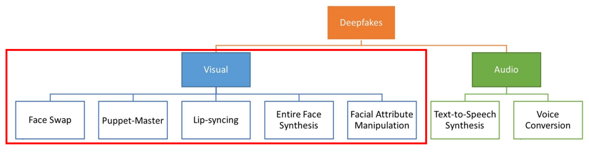
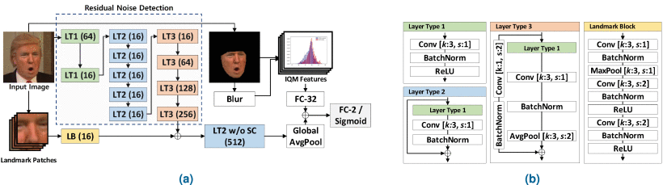

DeepFakes의 생성과 탐지에 대해 살펴보고, 사회적 문제를 야기시키는 deepfakes를 방어하기 위한 연구를 진행한다.

1. toc 
{:toc .large-only}

## Deepfakes
딥페이크란 'Deep Learning'과 'Fake'의 합성어로, 딥러닝을 통해 얼굴부분이 조작된 영상을 만들어 내는 기술을 말한다. 딥페이크는 의료환자 데이터를 증강하거나 모습 복원을 통해 영화에서 구현하기 어려운 부분을 해결하는 등의 순기능을 가지고 있다. 하지만 이 기술을 악용할 경우, 정치적 큰 이슈가 될 수 있는 가짜뉴스나 음란물에 대한 얼굴 합성 등의 사회적인 문제를 일으킬 수 있다. 따라서 해당 페이지에서는 딥페이크 생성과 함께 방어 기법을 살펴보며 논문에서 제시한 방법론까지 설명하려 한다.

## Deepfake Generation

그림1. Masood, Momina, et al. "Deepfakes Generation and Detection: State-of-the-art, open challenges, countermeasures, and way forward." Applied Intelligence (2022): 1-53.
{:.figcaption}

[visual deepfakes]{:.heading.flip-title} 에서는 그림1의 5가지 visual deepfakes 생성 방법에 대해 자세히 설명한다.

## Deepfake Detection

그림2. Proposed network architecture for deepfake detection. (a) Detection network structure, (b) details for layer types (LTs) and landmark block (LB). Kang, J., Ji, S. K., **<U>Lee, S.</U>**, Jang, D., & Hou, J. U. (2022). Detection Enhancement for Various Deepfake Types Based on Residual Noise and Manipulation Traces. IEEE Access, 10, 69031-69040. 
{:.figcaption}

딥페이크의 유형은 face-swap, puppet-master, and attribute-change 와 같이 다양하게 존재한다. 이때 딥페이크 탐지 단일 모델로는 이렇게 다양한 유형을 모두 탐지하는데에 한계가 있다. 본 연구에서는 딥페이크로 형성된 이미지에서 공통적으로 나타나는 흔적 3가지를 탐지하여 위 3가지 유형의 딥페이크를 잘 탐지해 낼 수 있는 방법을 제안한다. 

딥페이크 변환 시에 발생하는 residual noise를 감지하기 위해 steganalysis 분석을 위한 네트워크인 SRNet을 사용하고, 딥페이크 이미지의 부자연스러운 변형을 포착하기 위해 landmark를 이용한다. 추가로 딥페이크 효과를 통해 나타나는 blur 흔적을 캡쳐하기 위한 이미지 품질 측정 도구를 사용하여 다양한 유형의 딥페이크 데이터에 안정적인 탐지를 보였다.

{:.related-posts.faded}

[visual deepfakes]: visual-deepfakes.md
