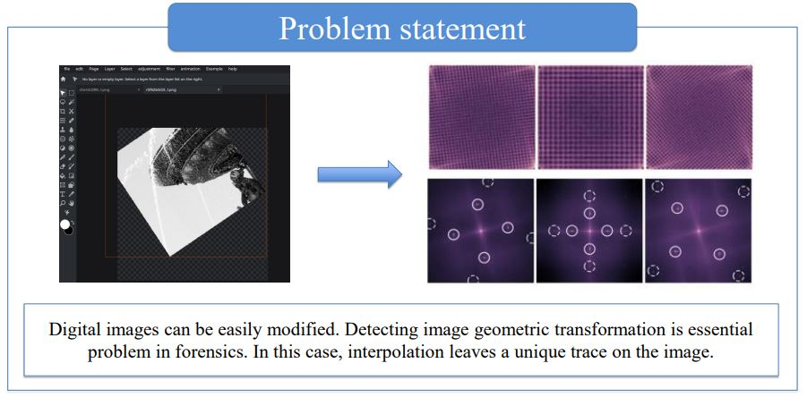
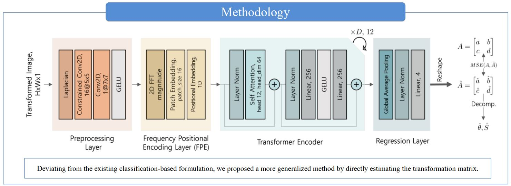
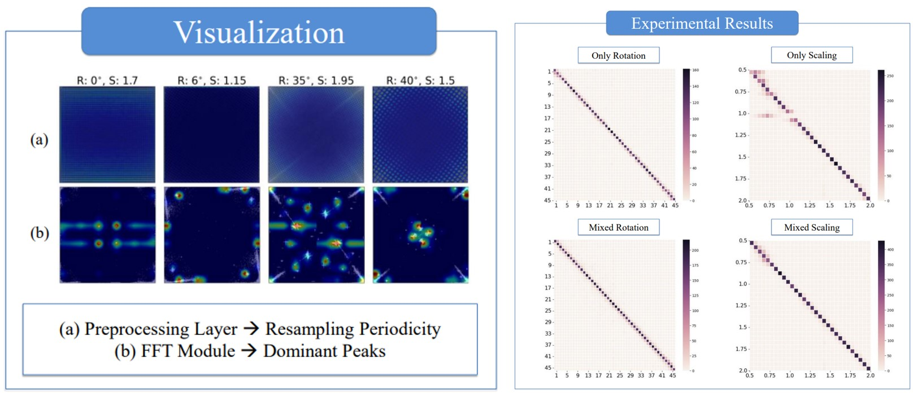

ACM Multimedia 2022 에 게재된 논문 소개 및 작성 과정을 작성한 포스트 입니다.  
구체적인 내용은 [논문 링크](https://dl.acm.org/doi/abs/10.1145/3503161.3548233)를 통해 살펴보실 수 있습니다.
관련코드는 [깃허브 링크](https://github.com/Sang-Yeong/geometric-transformation-estimation)에 나와있습니다.

1. toc 
{:toc .large-only}

## 논문 소개

### 1. Problem Statement and Visualization

디지털 이미지는 전문가가 아닌 일반 사람들도 누구나 쉽게 조작이 가능하다. 따라서 이런 조작을 탐지하는 것은 디지털 포렌식 분야에서 중요한 문제이다. 본 논문은 다양한 이미지 조작 중에서 이미지 크기변환(scaling)과 회전(rotation)과 같은 **기하학적 변환(geometric transformation)**을 주로 다룰 것이다.

이미지의 기하학적 변환이 이루어질 때는 interpolation(보간) 과정을 항상 거치게 된다. 이때 interpolation은 특이한 흔적을 남기게 되고, 이런 resampling artifact라 불리는 흔적을 통해 이미지의 기하학적 변환 값을 추정해내는 end-to-end transformer-based estimator를 제안한다.

### 2. Methodology

제안하는 모델은 총 4개의 모듈로 구성된다.

- Preprocessing layer: 이미지의 resamplint artifacts를 강조하는 역할
- FPE layer: resamplint artifacts의 주기성을 파악하여 주파수 도메인변환을 통해 peak를 나타내는 역할
- Transformer encoder: peak 에 모델이 focus할 수 있도록 하는 역할
- regression layer: 기하학적 변환 변수를 직접적으로 예측하도록 하는 역할

### 3. Results

왼쪽부터 차례로 각 레이어에 따른 시각화 결과와 Scaling, rotation factor에 대한 confusion matrix 결과이다.

## 논문 작성 과정

* [Background]{:.heading.flip-title} --- 논문의 background 설명 및 관련 논문 소개
* [Related Work]{:.heading.flip-title} --- 논문 관련연구 소개
* [Dataset]{:.heading.flip-title} --- 이미지 포렌식에서 사용하는 데이터셋 소개

{:.related-posts.faded}

[Background]: background.md
[Related Work]: related.md
[Dataset]: dataset-type.md